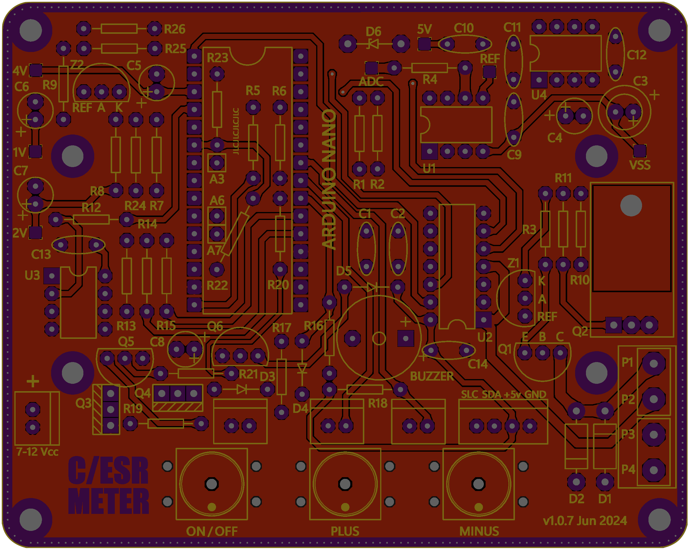

# Gerber files for "C/ESR Meter"

**Board revision v1.0.7 (Jun 2024)**

```
File List
---------
Top Copper              : C_ESR_METER_107_R19 - CADCAM Top Copper.GBR
Bottom Copper           : C_ESR_METER_107_R19 - CADCAM Bottom Copper.GBR
Top Silk Screen         : C_ESR_METER_107_R19 - CADCAM Top Silk Screen.GBR
Bottom Silk Screen      : C_ESR_METER_107_R19 - CADCAM Bottom Silk Screen.GBR
Top Solder Resist       : C_ESR_METER_107_R19 - CADCAM Top Solder Resist.GBR
Bottom Solder Resist    : C_ESR_METER_107_R19 - CADCAM Bottom Solder Resist.GBR
Drill, Unplated, 1-16   : C_ESR_METER_107_R19 - CADCAM Drill TOP-BOT NonPlated.GBR
Drill, Plated, 1-16     : C_ESR_METER_107_R19 - CADCAM Drill TOP-BOT Plated.GBR
Drill, Filled, 1-16     : C_ESR_METER_107_R19 - CADCAM Drill TOP-BOT Filled and Plated.GBR
Netlist                 : C_ESR_METER_107_R19 - CADCAM Netlist.IPC
```

## Top view

