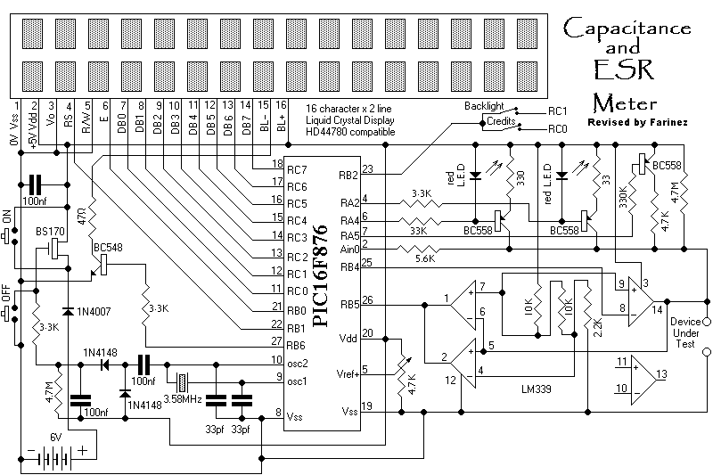
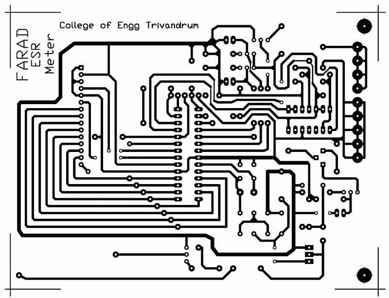
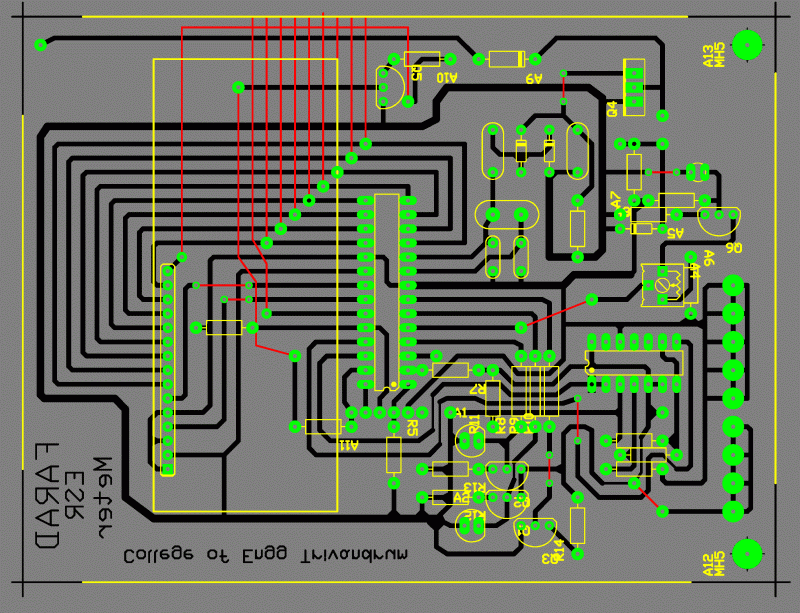
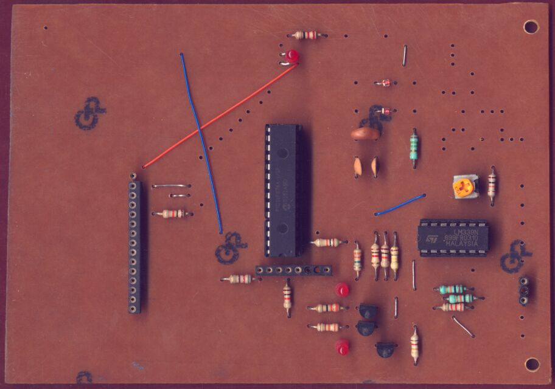

# PIC Based Low Cost ESR meter (2004)

## Schematics and images:
   - https://web.archive.org/web/20070105002912/http://saint.419.removed.us/esrtest.html
   - https://www.electronica-pt.com/circuitos/en/pics/esr-meter

## ASM source code: 
   - https://electronics-diy.com/schematics/856/esrprg.html
   - https://www.electronica-pt.com/circuitos/zip/esr-meter.txt.zip

## Project Specifications
- **PIC**: PIC16F876A
- **Processor Frequency**: 3.58MHz
- **Display Type**: 16 Character x 2

ESR Meter can read equivalent serie resistor in a capacitor inserted in circuit.

**Use**: The capacitance value of the device under test (DUT) is measured finding time taken to charge it to a particular voltage.

The ESR of DUT is measured subjecting it to a knowned current pulse and read voltage across it.

**Calibration**: Take a good capacitor, around 100 or 1000 microfarads, and connect a small resistor, 10 or 5 ohms, in series with it. Connect to the meter and adjust that pot until the meter reads the resistance of that resistor. Repeat with other capacitors and resistors as a check on your calibration.

**Limitations**: Capacitors smaller than about 10 microfarads cannot be measured with ESR. Capacitance down to 10 picofarads may be measured, however devices with appreciable leakage cannot be measured at all for capacitance.

This is a design for a capacitance and ESR meter using a PIC16F876.

The track pattern

The PCB overlay

The partly populated circuit board

## Working:

The capacitance of the Device Under Test (DUT) is measured by finding the time taken to charge it to a particular voltage.

The Equivalent Series Resistance (ESR) of the DUT is measured by subjecting it to a pulse of known current, and finding the voltage developed across it.

## Capacitance Measurement:
There are two ranges: A resistance of 4.7 Megohms is directly connected from the "hot" terminal of the DUT to the positive supply voltage. A resistance of 4.7 Kilohms can be connected to the positive rail by switching a transistor on.
Initially, the measurement is attempted with the 4.7K resistor. The time taken for the DUT to charge to a particular voltage is measured. If the result is too small, the resistor is switched off and the measurement is attempted again with the 4.7M resistor. Thus the two ranges differ by a factor of 1000.

## ESR Measurement:
There are two ranges: First, a constant current source of about 5 mA is switched on and the voltage across the DUT is measured. If the reading is too low, the voltage reading is repeated with a current of 50 mA. Thus the two ranges differ by a factor of 10.

The DUT is discharged using one comparator in the LM339 as a switch. Adequate time has to be allowed in between readings in order to discharge the DUT fully.

The measurement of ESR is only valid for capacitors larger than about 10 microfarads or so. This is because smaller capacitors charge up from the pulse of current used to test them.

## Principle of Measurement: Capacitance

The DUT is discharged to get rid of any charge it might have accumulated during the previous measurement cycle.

It is then connected to the positive rail through a 4.7 Kilohm resistor. Two comparators in the LM339 monitor the voltage on the DUT as it charges up.

The two comparators are connected as a window discriminator. The communed output of these two comparators will be high when the input is above the lower threshold of around 10% supply voltage and go low when it crosses the higher threshold of around 50% supply voltage. The lower threshold has been used in order to obviate any errors due to the DUT not being discharged completely.

The width of the pulse of the window discriminator is proportional to the capacitance of the DUT. This is measured in a loop. Calibration is by adjusting the delays inside this loop, by padding it with goto's and nop's.

If the result points to a small value of capacitance, the measurement is attempted again with just the 4.7 Megohm resistor. This time, the pulse width is measured by a separate loop so that the range can be separately calibrated. This loop has the provision of compensating for the fixed capacitance of the circuit in parallel with the DUT (zeroing).

## Principle of Measurement: Equivalent Series Resistance

Again, the DUT is discharged to get rid of any charge it might have accumulated during the previous measurement cycle.

It is then subjected to a short pulse of current - just long enough for the ADC inside the PIC to acquire a reading. Since the pulse is short, the capacitive part of the DUT is assumed to be uncharged. The voltage drop across the DUT is then contributed by its ESR alone. Thus the voltage read from the ADC is proportional to the ESR, and may be displayed as such.

This measurement is calibrated by adjusting the reference voltage applied to the internal ADC of the PIC.

## Limitations

Capacitors smaller than about 10 microfarads cannot be measured for ESR. Capacitance down to 10 picofarads may be measured, however. Devices with appreciable leakage cannot be measured at all for capacitance.

## Bugs

The instrument hangs for a long time if a large capacitor is connected while it is measuring in the low capacitance range.

## Enhancements

A fast Sample-and-Hold Amplifier could be used ahead of the PIC analogue input in order to extend the measurement range of ESR to devices of lower capacitance.