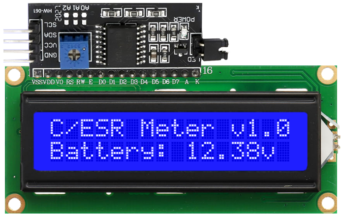

# C/ESR Meter

Capacitance "**C**" and equivalent series resistance "**ESR**" meter for electrolytic capacitors.

Hardware and software reimplementation of the Russian capacitance and ESR meter for electrolytic capacitors, posted on ["Pro-Radio" forum](https://pro-radio.online/measure/3288/) in 2006 by Gints Oleg (Гинц Олег) "GO". As he himself explains on [this website](http://www.rlc-esr.ru/index.php/ru/izmeritel-s-i-esr), he was inspired by a [previous project from 2004](Project_2004), about which there is not much information. Original Gints Oleg design is for sale as "DIY kit" on the ["Modul-X website."](http://modul-x.ru/radiokonstruktory/pribory/izmeritel-emkosti-i-posledovatelnogo-ekvivalentnogo-soprotivleniya-elektroliticheskikh-kondensatorov-c-esr-meter.htm)

In 2021 the user "**wegi1**" from the "Open Source Hardware Lab" forum publishes two projects that include the schematic and the PCB in "EasyEDA", [two dual Op-Amps](https://oshwlab.com/wegi1/oleg-c-esr-meter) and [one quad Op-Amp](https://oshwlab.com/wegi1/go-esr-c-meter)

In 2022 the Spanish Youtube channel "**RDT**" [Reparando de todo](https://www.youtube.com/watch?v=-c8M0YjmY34&list=PLTIVqAL9EezMypRtiyRqnYZjx48QQSnEL) make and share own SMD designs from original based. 

This device is not a precision instrument, but it is sufficient for the practice of radio amateurs and electronic repairs.

It is published under **Open Hardware** and **Open Source** licenses:
   - [CERN Open Hardware Licence Version 2 - Strongly Reciprocal](https://ohwr.org/cern_ohl_s_v2.txt)
   - [GNU General Public License v3.0](https://www.gnu.org/licenses/gpl-3.0.txt)
   - [Creative Commons Attribution-ShareAlike 4.0 International Public License](https://creativecommons.org/licenses/by-sa/4.0/legalcode.txt)

  

## Main features
- Measures ESR from 0.001Ω to 15.00Ω (approx), in two ranges.
- Measures capacitance from 1uF to 100,000uF (approx) very quickly.
- Its electronics are very simple, easy and cheap to build.
- Works below 100 mV on the capacitor under test, allowing in-circuit measurements.
- No capacitor pre-discharge required.
- Calibration by software.


## Principle of measurement
Measuring the capacitor's ESR is based on subjecting it to a pulse from a known current source and measuring the voltage drop across it.

The capacitor will be connected to a known constant current source "I=10mA" for a precise short period of time "10μS", when the capacitor is disconnected from the current source, the voltage across it will decrease as a function of "I*R". Knowing the current and voltage drop, the ESR can be calculated. It should be noted that this principle of measuring ESR is not new, it is simply not very common.

The capacitance is calculated by measuring the charging time of the capacitor between 30mV and 60mV with the same constant current of 10mA. In practice, the "33" gain output is used to compare it with 1V and 2V references.
This time is relatively small, approximately 3 microseconds per microfarad, but can be measured with sufficient precision for the most common capacitances of electrolytic capacitors.


## Reimplementation motivation
I learned about the GO meter thanks to "**RDT**" [Reparando de todo](https://www.youtube.com/watch?v=kafeiWaOLkQ) YouTube channel, which did a great job spreading the word about it.
And I immediately wanted to build one, but I also wanted to be able to modify it to my liking, and the fact that the code was written in assembler language posed a considerable difficulty. Furthermore, the language used was Microchip Assembler (MPASM), which is deprecated in favor of MPLAB XC8 PIC Assembler (pic-as). The last version that includes MPASM was [MPLAB X IDE v5.35 (2020)](https://ww1.microchip.com/downloads/en/DeviceDoc/MPASM%20to%20MPLAB%20XC8%20PIC%20Assembler%20Migration%20Guide%2050002973A.pdf).

Therefore, it made no sense to maintain or rewrite the code in assembler language, and I chose to reimplement it in a more comfortable language like C/C++. So it was no longer necessary to continue using a Microchip PIC, being able to use an Atmel AVR like those used by Arduino ecosystem, having numerous development boards and abundant open software libraries and tools.

This reimplementation of the software and hardware has been possible thanks to the fact that both the scheme and the source code were published, which could be compiled and executed in a simulator, which allowed obtaining a [basic flowchart of the GO meter operation](Russian_source/go_esr_flowchart.png).

Modifying the hardware allows you to add several improvements, some of them absolutely essential:


### VREF Voltage Reference 4 volts
An absolutely essential improvement is to add a 4V voltage reference to use as the VREF of the ADC, from which the 2v and 1v voltages, used as comparator inputs, would also be derived using simple voltage dividers.

Using Vcc (approximately 5V) as the ADC reference voltage is a very bad idea, since this voltage is highly variable and unstable, and it can never be reached at the output of the Op-Amps (if these do not have Rail-to-Rail output), losing measurement range.

The most accurate option would be to use a voltage reference of 4096mV, such as the LM4040 or MCP1541, which are inexpensive and even available in their manufacturers' sample programs, but the simplest thing would be to use another TL431 since it is easily configurable to 4v with only two resistors of 12kΩ and 20kΩ.

$V_o=2.5v*(1+\frac{R1}{R2})=2.5v*(1+\frac{12000Ω}{20000Ω})=2.5v*(1+0.6)=2.5v*1.6=4v$


### AD620 Instrumentation amplifier
Another important improvement is replacing the four operational amplifiers (two TL072 dual Op-Amps or one TL084 quad Op-Amp) with a single AD620 instrumentation amplifier whose gain is configurable, being set by default to "33" and using one of the four switches on the CD4066B that was not used, the "330" gain can be selected.

The AD620 formula to calculate the resistances $R_g$ is:

$G=\frac{49.4kΩ}{R_g}+1$ 

$R_g=\frac{49.4kΩ}{G-1}$

Therefore:
 - For $G$ = 33, $R_g$ = 1543.75Ω approx **1.5kΩ** --> Single resistor (R1)
 - For $G$ = 330, $R_g$ = 150.15Ω approx **150Ω** --> 167Ω parallel circuit 1500Ω --> 92Ω (CD4066B $R_{on}$ @5v)<sup>1</sup> + 75Ω (R2)

 <sup>1</sup> CD4066B Quad bilateral analog switch $R_{on}$ @5v must be measured.

VSS (-5V) negative voltage is still necessary, because it operates very close to zero voltage. Even modern Rail-to-Rail Op-Amps do not achieve an acceptable lineal result when operating so close to zero volts.
But now, the VSS level is not critical, it does not require lineal regulator or manual offset adjustment, since the AD620 has a reference terminal to set the potential that defines the zero output voltage, which can be connected directly to GND.

#### Original circuit with four generics Op-Amps 


#### New circuit with one instrumentation amplifier AD620


### MCU ATMega328p "Arduino Nano"
The microcontroller update is another substantial improvement, not only due to the increase in the capacity of program memory and RAM, since when using the Arduino framework there are low-cost development boards, which include all the necessary components and many accessories, from quartz crystal and capacitors, to voltage regulators and USB to Serial converters.
They also include a bootloader that makes it very easy to update firmware using a simple USB connection, without the need for an external hardware programmer.

* Change MCU from Microchip PIC16F87xA to Atmel ATMega328p (Arduino Nano (USB to Serial bridge included))
* Change programming language from old Microchip Assembler (MPASM) to modern C++ standard (avr-gcc c++11)
* Change float resolution from Microchip's 24-bit to IEEE-754 32-bit standard. [See the AN575 Python module for conversions.](https://github.com/latchdevel/AN575)
* Change the external ICSP hardware programmer to built-in USB bootloader for easy firmware update via USB connection.

| MCU        | SRAM (bytes) | Program Memory (KB)| Data EEPROM (bytes) |
|:-----------|-------------:|-------------------:|--------------------:|
| PIC16F873A |          192 |                  7 |                 128 |
| PIC16F876A |          368 |                 14 |                 256 |
| ATMega328p |         2048 |                 32 |                1024 |

### LCD I2C
Another improvement has been to change the connection interface of LCD display to I2C, adding a PCF8574 adapter, but this really simplifies its use and connection and provides greater flexibility when making modifications or expansions.
* Change from direct 4-bit HD44780 LCD interface to I2C interface via PCF8574 adapter.
* Change from raw display management to the comfortable ["LiquidCrystal I2C" Arduino library](https://www.arduino.cc/reference/en/libraries/liquidcrystal-i2c), that must be install via Arduino IDE library manager.



### Others hardware improvements:
* Add reverse polarity protection by MOSFET P-Channel transistor (Q3)
* Add power-on (Q4) and power-off (Q5) circuits 
* Add clamping diode protection (D6) to ADC
* Add buzzer with driver (Q6) and flyback diode protection

# Schematic

[](Images/A3_107_schema_RC00.png)

# PCB
The proof-of-concept PCB is designed in just two layers with through-hole components so you can easily build it yourself, maintaining a small enough size for cheap manufacturing.

* Board size: 98mm x 78mm
* Distance between corner mounting holes: 90mm x 70mm
* Available LCD display (16x02) mounting holes: 75mm x 31mm


Gerber files for PCB manufacture are available [here](Gerber).

Bill of materials (BOM) for the complete assembly is available [here](BOM.md).

## Additional software improvements:
* Software power-off
* Software timed auto power-off with warning and clear
* Split “Test Mode” functions, (+) for capacitance “ticks” and (-) for raw ADC values ​​in 1Ω and 10Ω ranges
* Calibration Menu displays values and makes changes on the fly
* Add configuration options for ESR "Set to Zero" ​​in 1Ω and 10Ω ranges
* Add exponential moving average as IIR digital filter for Cx measures, with auto-hold and manual remeasure
* Low voltage battery protection
* Serial output debug info
* Serial output trace values (for graphic plot)

### Debug serial output example:

```
Booting C/ESR Meter v1.0
Battery: 12.38v

Hardware configuration:
-----------------------------
ADC_VREF_VALUE:       4.070
VBATT_FACTOR:         3.740
VBATT_MIN:            6.000v (max: 15.22v)

Hardware based parameters:
-----------------------------
M_ESR_1:              599.00
M_ESR_10:             79.00 (ESR limit: 12.95 ohms)
U330threshold:        950
M_Cx:                 51.00
add_Cx:               1000
ACD_MEASURES:         20
COMP_TIMEOUT:         80 (327 msecs) Cx max: 104085 uF

User calibration settings:
-----------------------------
ESR factor 1 ohm:     1.000
ESR factor 10 ohms:   1.000
Cx factor:            1.000
Cx counter:           1000
ESR set zero 1 ohm:   54
ESR set zero 10 ohms: 0

Auto power off warning timer: 120 secs (approx)
Auto power off timer:         180 secs (approx)
```

### Graphic plot serial output example:


## Documentation
- [X] [Schematic](Images/A3_107_schema_RC00.png)
- [X] [Gerber PCB files](Gerber)
- [X] [BOM](BOM.md)
- [X] [Arduino C++ source code](C_ESR_METER.ino)
- [X] [PIC ASM source code](Russian_source/go_esr_1.17_2023_UTF8.asm)
- [X] [PIC ASM flowchart](Russian_source/go_esr_flowchart.png)
- [X] [PIC AN575 float format](https://github.com/latchdevel/AN575)
- [ ] Enclosure's 3D model
- [ ] Build guide
- [ ] Calibration manual
- [ ] User manual

# Remembering Bob Pease "RAP"
[Robert Allen Pease "RAP"](https://en.wikipedia.org/wiki/Bob_Pease) (August 22, 1940 - June 18, 2011) 

[](https://en.wikipedia.org/wiki/Bob_Pease)
