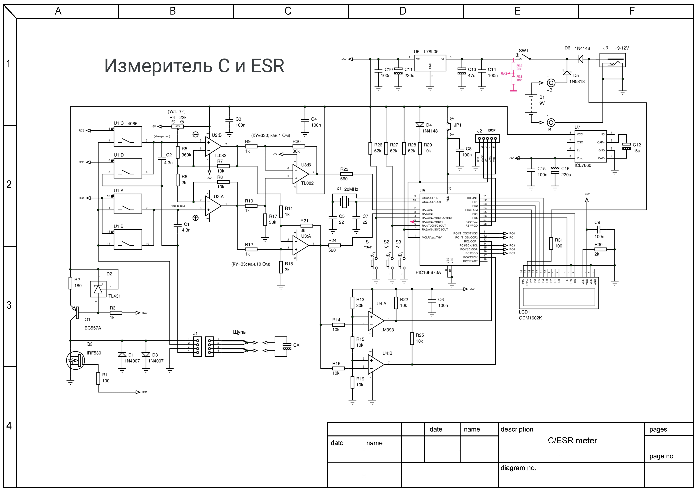

# Измеритель С и ESR.

Source: https://www.rlc-esr.ru/index.php/ru/izmeritel-s-i-esr

I have long wanted to make a device for checking electrolytes that, along with ESR, would also measure capacity. Everything I came across on the Internet on this topic was somehow unsatisfactory. After trying out some ideas, I settled on the option of determining ESR by measuring the magnitude of the voltage drop (step) when the capacitor is DISCONNECTED from the current source. Capacity is determined in the traditional way - measuring the charging time with a stable current (10 mA)
 
The device is designed to determine the health of electrolytic capacitors by measuring capacitance (C) and equivalent series resistance (ESR). The device is not a precision instrument, but its accuracy is sufficient for amateur radio practice and repair of radio-electronic devices. The voltage across the element under test is about 100 mV, which allows for in-circuit measurements. Protection of input circuits is traditional - two back-to-back diodes and is ineffective. It is better to solve this problem mechanically - with the help of special probes, which in the normal state are closed to each other through a resistance of about 5 Ohms, and when the probe is pressed, this circuit would open.

**Measurement limits:**
 - C: 1 - 150000 µF
 - ESR: 0 - 10 Ohm

## Principle of measurement

The device uses the principle of measuring ESR - almost constant current. I’ll try to explain in more detail, let’s imagine a SIMPLIFIED equivalent equivalent circuit of an electric capacitor - the actual ideal capacitor C and the resistance R connected in series with it. Let's connect this circuit to a current source I. At the initial moment, the voltage on this circuit will be equal to U=I*R, then the voltage will increase linearly due to the charge of the capacitor U=I*R+I*t/C (t-time). When the capacitor is disconnected from the current source, the voltage across it will decrease by the amount I*R. This value is measured by the device. Knowing the current and the magnitude of the voltage drop, we obtain ESR.

In practice, it looks like this - the capacitor is first discharged, a 10 mA current source is turned on, both inputs of the measuring amplifier are connected to Cx, a delay of about 3.6 μs is made to eliminate the influence of ringing in the wires. Simultaneously via DD2.3 keys || DD2.4 charges capacitor C1, which actually remembers the highest voltage that was on Cx. The next step is to open the keys DD2.3 || DD2.4 and the current source is turned off. The inverting input of the remote control remains connected to Cx, on which, after turning off the current, the voltage drops by 10 mA * ESR. That's actually all - then you can easily measure the voltage at the output of the remote control - there are two channels, one with KU = 330 for the limit of 1 Ohm and KU = 33 for 10 Ohms. It turns out that these same analog circuits are used to measure capacitance.

It should be noted that this principle of ESR measurement is not new, it just does not occur very often. Here is the most similar design, only here the measurement is carried out when the current is turned on. A similar principle was used in the [“Digital ESR Meter” by S. Biryukova, Circuit Engineering 2-3 2006.](../Project_2004/)

## Schematic

## BOM

## Setup and management

First turn on - check for the presence of +5V after 78L05 and -5V (4.7V) at the DA4 output. By selecting R31 we achieve normal contrast on the indicator.
Turning on the device while pressing the Set button puts it into the mode for setting correction factors. There are only three of them - for 1 Ohm, 10 Ohm channels and for capacitance. Changing coefficients using the + and - buttons, writing to EEPROM and searching through the same Set button.
 
There is also a debugging mode - in this mode the measured values are displayed on the indicator without processing - for capacitance - the state of the timer (approximately 15 counts per 1 µF) and both ESR measurement channels (1 ADC step = 5V/1024). Switch to debugging mode - while pressing the "+" button.
 
Zero setting. To do this, we close the input, press and hold the “+” button and, using R4, achieve minimum readings (but not zero!) simultaneously on both channels. Without releasing the "+" button, press Set - the indicator will display a message about saving U0 in EEPROM. Next, we measure standard resistances of 1 Ohm (or less), 10 Ohms and capacitance (which you trust), and determine correction factors. We turn off the device, turn it on while pressing the Set button and set the coefficients according to the measurement results.
Indication.

The measured values are displayed in digital format on a two-line LCD. The top line displays the capacitance, and the bottom line displays the ESR of the capacitor.

The inscription "`Cx ----`" is displayed in the following cases:

   - When measuring capacitance, a timeout is triggered, i.e. During the allotted measurement time, the device did not wait for both comparators to switch. This happens when measuring resistors, shorted probes, or when the measured capacitance is >150,000 µF, etc.

   - When the voltage measured at the DA2.2 output exceeds 0x300 (this is the ADC reading in hexadecimal code), the capacitance measurement procedure is not performed and Cx ---- is also displayed on the indicator. With open probes (or R>10 Ohm) this is how it should be.

The "`>`" sign in the ESR line appears when the voltage at the DA2.2 output exceeds 0x300 (in ADC units).

## Parts and probes

LCD module based on the HD44780 controller with 16 characters, 2 lines. There are versions with “confused” legs 1 and 2 - ground and power. The correct marking must be found in the documentation for the indicator. Other indicators will require program changes. We will replace the microcontroller with a PIC16F873 with a clock frequency of 20 MHz. We will replace the IRF530 transistor with IRF520, IRF540, IRLZ44n.

Remote probes are connected using a four-wire circuit to reduce the influence of wire resistance on the measurement result. The wires going to ground and transistor VT2 need to be thicker.

The device is being discussed on the forum: https://www.pro-radio.ru/measure/3288/

## Flowchart

